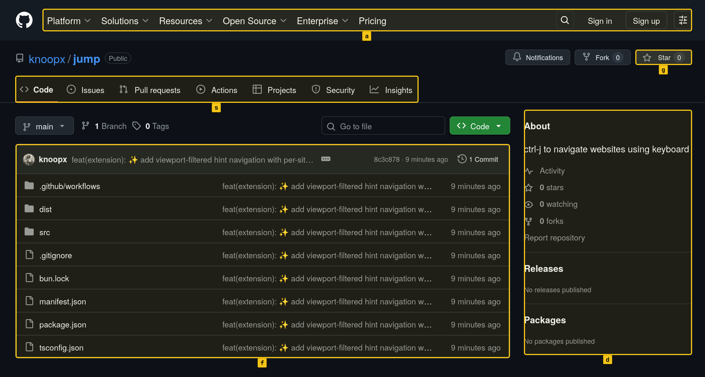
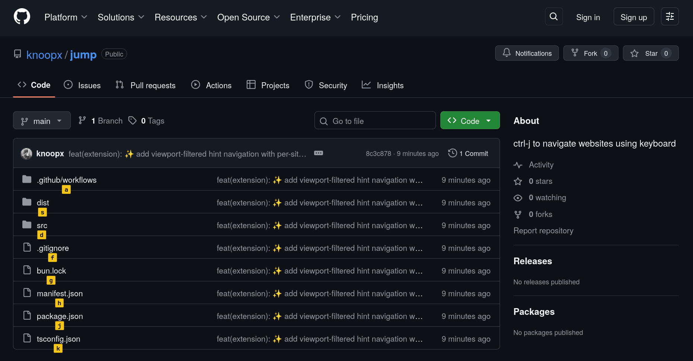

# Jump

Keyboard-driven hint navigation for websites as a Firefox extension.

## Screenshots

### Group hints by page section



### Drill-down hints after selection



## What it does

- Press `Ctrl+J` to toggle hints on/off.
- Hints are grouped by selector sections (header/sidebar/main/etc. per site).
- Type hint keys to narrow and select.
- If a group is selected, Jump can auto-scroll to that group.
- Hints are filtered to visible elements in the current viewport.

## Install (from release)

1. Download the `.xpi` asset from GitHub Releases.
2. Open Firefox.
3. Go to `about:addons`.
4. Click the gear icon → **Install Add-on From File...**
5. Select the downloaded `.xpi`.

## Development

### Requirements

- [Bun](https://bun.sh)
- Firefox (for extension testing)

### Setup

```bash
bun install
```

### Build

```bash
bun run build
```

### Run in Firefox (temporary add-on)

```bash
bunx web-ext run --source-dir .
```

## Project structure

- `src/content.ts` — key handling + interaction flow
- `src/hints.ts` — hint creation, grouping, relabeling, viewport filtering
- `src/selectors.ts` — per-domain selectors grouped by page sections
- `manifest.json` — extension manifest

## Release

GitHub Actions workflow (`.github/workflows/release.yml`) builds and publishes an installable `.xpi` on tag push (`v*`).

Example:

```bash
jj tag create v0.1.1 -r @
jj git push --tags
```

## Notes

- Selectors are site-specific and should be manually validated against live DOM changes.
- Dynamic/login-heavy websites may require periodic selector updates.
