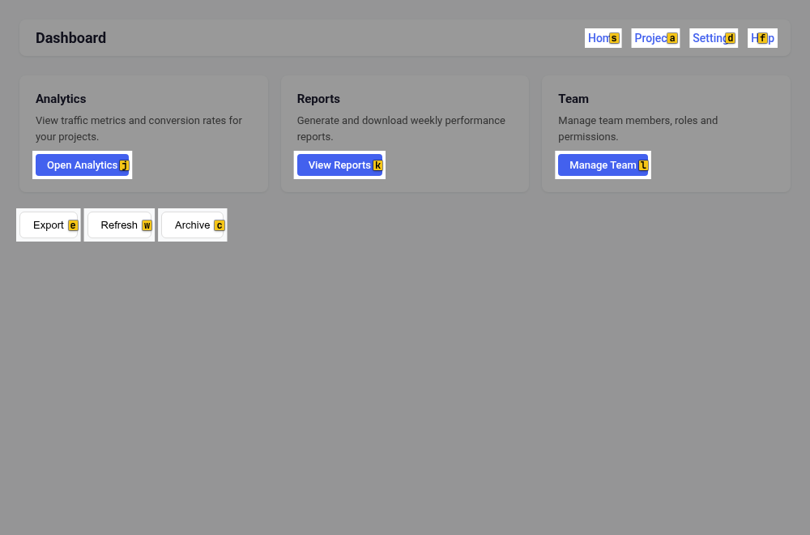
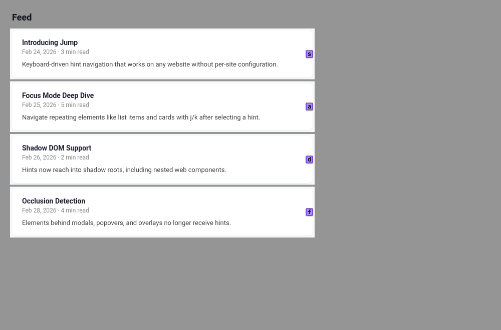
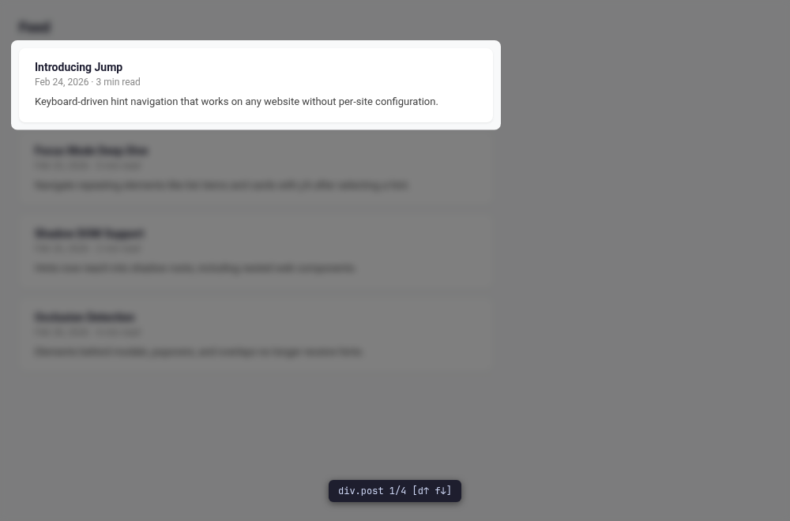

# Jump

Vimium-style keyboard-driven hint navigation for websites as a Firefox extension.

Re-implemented based on [vimium-c](https://github.com/gdh1995/vimium-c) for comprehensive clickable element detection.

## Screenshots

### Click mode (`Ctrl+Shift+J`)



### Focus mode (`Ctrl+Shift+K`) — hint selection



### Focus mode — navigation with `j`/`k`



## What it does

- Press `Ctrl+Shift+J` to activate click hints on all clickable elements.
- Press `Ctrl+Shift+K` to activate focus hints for navigating lists and sections.
- Works on any website — no per-site configuration needed.
- Detects links, buttons, inputs, and other interactive elements (not just `cursor: pointer`).
- Unique multi-character labels appear on every clickable element.
- Type characters to filter hints by prefix — matched characters dim.
- When only one hint matches, the element is clicked automatically.
- Press `Backspace` to undo the last typed character.
- Press `Escape` to dismiss hints.
- Hints are filtered to visible, non-occluded elements in the current viewport.

## Install (from release)

1. Download the `.xpi` asset from GitHub Releases.
2. Open Firefox.
3. Go to `about:addons`.
4. Click the gear icon → **Install Add-on From File...**
5. Select the downloaded `.xpi`.

## Development

### Requirements

- [Bun](https://bun.sh)
- Firefox (for extension testing)

### Setup

```bash
bun install
```

### Build

```bash
bun run build
```

### Run in Firefox (temporary add-on)

```bash
bunx web-ext run --source-dir .output/firefox-mv2
```

### Run tests

```bash
bun run cy
```

## Project structure

- `entrypoints/content.ts` — key handling + interaction flow
- `lib/click.ts` — clickable element detection (vimium-c style)
- `lib/focus.ts` — focus mode navigation with depth levels
- `lib/hints.ts` — hint creation, labeling, filtering, positioning
- `lib/visibility.ts` — visibility and occlusion detection
- `lib/selectors.ts` — CSS selector building for focus navigation

## Key bindings

| Key | Action |
|-----|--------|
| `Ctrl+Shift+J` | Activate click hints |
| `Ctrl+Shift+K` | Activate focus hints |
| `a-z` | Type hint characters to filter/select |
| `Backspace` | Undo last typed character |
| `Escape` | Dismiss hints |
| `j`/`k` | Navigate in focus mode |
| `d`/`f` | Change depth in focus mode |

## Release

GitHub Actions workflow (`.github/workflows/release.yml`) builds and publishes an installable `.xpi` on tag push (`v*`).

Example:

```bash
jj tag create v0.1.1 -r @
jj git push --tags
```
